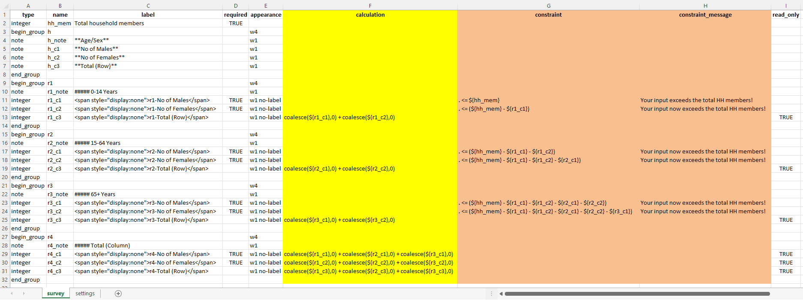
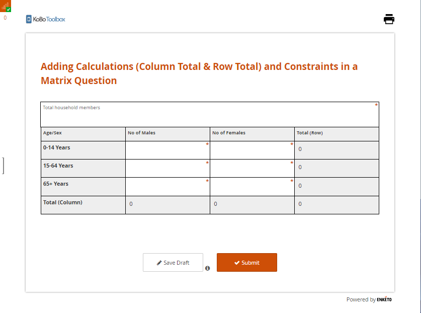

# Adding Calculations and Constraints in a Matrix Question

**Last updated:**
<a href="https://github.com/kobotoolbox/docs/blob/938f1a16fc473000bf3343365f2d61eaceb45af4/source/calculations_constraints_matrix.md" class="reference">14
Apr 2022</a>

When working in the formbuilder, it is simple to
[add calculations](calculate_questions.md) or
[constraints](validation_criteria.md) to almost any question type. While the
formbuilder does not currently support adding these features to a matrix
question, you can use XLSForm to do so. The steps listed below in this support
article will illustrate how you can add calculations and constraints to a matrix
question using XLSForm.

## Setting up the question and fields

**Step 1: Create a matrix question in the formbuilder**

The first step is creating a matrix question in the formbuilder (as outlined in
the support article [Question Matrix Response Type](matrix_response.md)). Simply
add rows and columns with the variables necessary for data collection.

**Step 2: Download the form as XLSForm**

Once the matrix question has been created, **SAVE** the form and
[download it as an XLSForm](getting_started_xlsform.html#downloading-an-xlsform-from-kobotoolbox).

**Step 3: Add logic to the matrix question**

Open the XLSForm and add `calculation`, `constraint` and `constraint_message`
column headers. With these column headers, you will be able to add the _column
total_ and _row total_ expressions under the `calculation` column header. You
can also add appropriate _constraints_ under the `constraint` column header and
_constraint message_ under the `constraint_message` header as needed.

Additionally, you may also choose to add a `read_only` column header to restrict
enumerators from editing the responses while collecting data to certain
questions (for example, the _row total_ and _column total_ that gets
calculated).

  In the image above, you may notice that the <code>name</code> inputs are
  shorter. In this example, they have been renamed from the ones auto-generated
  in the formbuilder to capture the entire screenshot of the survey tab. If you
  choose to rename yours, make sure to use your new variable names in the
  <code>calculation</code> and <code>constraint</code> column headers. If the
  form has already been deployed and data has been collected, it is recommended
  that you <em>do not</em> rename the existing variables.

**Step 4: Replace form**

Upload and replace your XLSForm within the existing project, or create a new
project (if needed).

**Step 5: Deploy form**

**Step 6: Collect data**

After deploying the form, you can go to **FORM>Collect Data>OPEN** to start
collecting data with the web form.

## Viewing the result

The following images illustrate how the form will look and function in the
Enketo web form after the above steps have been followed:

**No data is entered:**

**An input error is made:**

Here you will see that there are only five total household members. If an
enumerator enters 6 for the number of males (0-14 Years), the constraint will
show an error message.

**No input errors:**

Here, when you enter values in a matrix table, the rows and columns are
automatically calculated.

  You can download the XLSForm that was used for this article
  <a
    download
    class="reference"
    href="./_static/files/calculations_constraints_matrix/calculations_constraints_matrix.xlsx"
    >here</a
  >.

## Troubleshooting

-   The matrix question only works with **Enketo web forms**. It is not
    supported with the **KoboCollect Android App**.

-   The matrix table will appear distorted if you fail to set the layout to
    **Grid-theme**. For more details on web form appearances, you can refer to
    [Using Alternative Enketo Web Form Styles](alternative_enketo.md).
