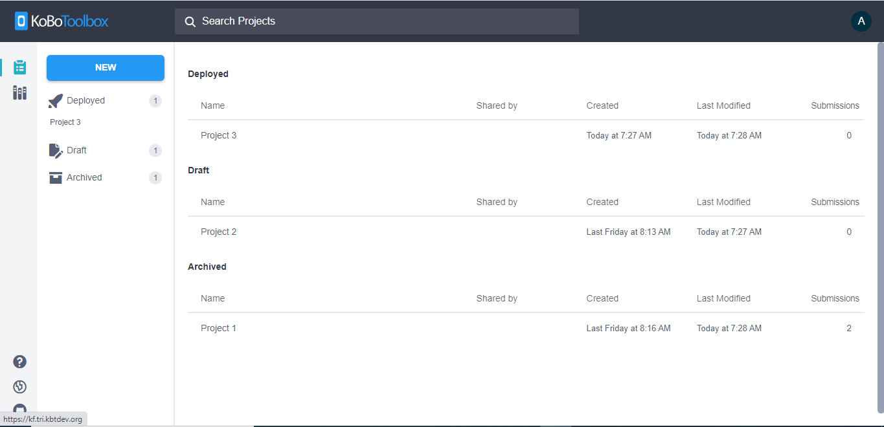

# The KoBoToolbox Interface

This article will walk you through the **KoBoToolbox** interface, helping you
get familiar with the different elements.

## Basic elements of the KoBoToolbox interface

By default, when you log in to your **KoBoToolbox** account, you will be taken
to the **Projects** screen.

You can switch between the <i class="k-icon k-icon-projects"></i> **Projects**
and <i class="k-icon k-icon-library"></i> **Library** sections using the buttons
on the top left of the screen.

### The search bar

Depending on whether you are on the **Projects** or **Library** section, the
search bar at the top allows you to quickly filter the items displayed.

### User profile options

On the far right of the search bar is your user account avatar. Clicking it
opens up a drop-down menu with options to change your account settings (such as
updating your basic information and changing your password), interface language,
and to log out.

### Draft, deployed and archived projects

In the **Projects** section of the interface, your individual projects are
organized into 3 categories.

1. **Draft** projects are forms that have been created but not deployed. These
   forms will not appear on **KoBoCollect** for data entry until they have been
   deployed.
2. When a form has been deployed, it will appear under **Deployed**. These forms
   are available for data collection through both **KoBoCollect** and **Enketo**
   web forms.
3. When data collection is complete, you can archive the project. These projects
   will appear under **Archived**.

### Project actions

Hover your mouse pointer over an item in the **Projects** screen to reveal the
following buttons:

<i class="k-icon k-icon-edit"></i> **Edit**. Takes you to the formbuilder to
edit the form.

<i class="k-icon k-icon-tag"></i> **Add Tags to the project**. Tags help making
it easier to find projects in the project list when you search using the search
bar.

<i class="k-icon k-icon-user-share"></i> **Share**. Lets you share the project
with other **KoBoToolbox** users and customize permissions.

<i class="k-icon k-icon-clone"></i> **Clone**. Let’s you make a copy of the
existing project.

<i class="k-icon k-icon-more-vertical"></i> **More actions**. Opens up more
project actions.

When you click the <i class="k-icon k-icon-more-vertical"></i> **More actions**
button, you have access to the following actions:

<i class="k-icon k-icon-replace"></i> **Replace form**. Allows you to replace
the current form with an **XLSForm**.

<i class="k-icon k-icon-globe-alt"></i> **Manage translations**. Takes you to
the **Manage Languages** screen where you can define languages and add
translations for the form.

<i class="k-icon k-icon-xls-file"></i> **Download XLS**. Generates an XLS file.
in the **XLSForm** standard from the current project. This allows you to continue
editing your form using **Excel** and easily collaborate with others.

<i class="k-icon k-icon-xml-file"></i> **Download XML**. Generates an XML file
from the current project. For advanced users, this let’s you explore the form
structure that may be needed when integrating with other applications, or to
make advanced changes to the form.

<i class="k-icon k-icon-archived"></i> **Archive**. Marks your deployed project
as archived. This turns off the ability to send more submissions to the project.

<i class="k-icon k-icon-template"></i> **Create template**. Saves the form as a
template in the library module.

<i class="k-icon k-icon-trash"></i> **Delete**. Allows you to delete the project
and the data submitted to it.

### Help, legacy interface and source code

On the bottom left of the interface, you can access support options including
links to the support articles site and the community forum by clicking on the <i
class="k-icon k-icon-help"></i> **Help** button.

Clicking the <i class="k-icon k-icon-globe"></i> **Projects (legacy)** button
takes you to the legacy interface.

If you are interested in contributing to the development of **KoBoToolbox** or
view the source code, you can click on the <i class="k-icon
k-icon-logo-github"></i> **Source** button to visit the GitHub page.
