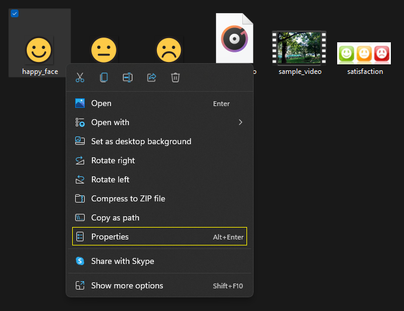
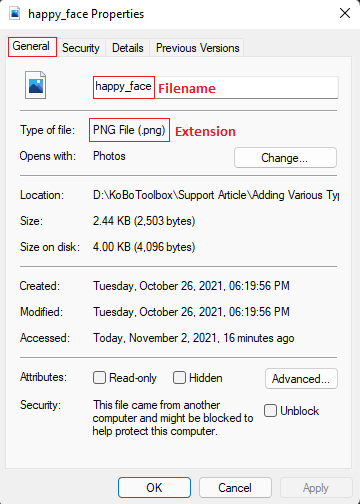

# Adding Various Types of Media (image, audio, video) to a Form

In addition to text questions and text choices, you can also add various types
of media (such as _image_, _audio_, and _video_) to your forms. Having media in
a form should sometimes be able to help you express your questions and choices
in a much better way.

Media in a form works both on **Collect android app** and **Web forms
(Enketo)**. These are the media files that are currently supported:

| Media | Files                                                         |
| ----- | ------------------------------------------------------------- |
| Image | jpeg, png, svg                                                |
| Audio | aac, aacp, flac, mp3, mp4, mpeg, ogg, wav, webm, x-m4a, x-wav |
| Video | 3gpp, avi, flv, mov, mp4, ogg, quicktime (qtff), webm, wmv    |

This support article aims to illustrate how forms with media can be created with
**KoBoToolbox**. Follow the instructions outlined below to include media to your
survey project.

## Step 1: Download Form as XLSForm

Create a survey project in the formbuilder UI and then download your form as
XLS to add media settings to it. The formbuilder currently does not support
adding media to the form directly so you will need to edit the downloaded
XLSForm to complete this action.

<video controls><source src="./_static/files/media/download_xlsform.mp4" type="video/mp4"></video>

## Step 2: Add Media Columns to your XLSForm

The file names added to the XLSForm must match the file names you
gave to your <em>image</em>, <em>audio</em>, and
<em>video</em> files.

### Adding Image Media Columns:

If you wish to add an **image** to a question, then type `media::image` as a
column header in the **survey** tab of your XLSForm. Type the image file name
along with an extension to the appropriate question just under the
`media::image` column header.

Similarly, if you wish to add an **image** to a choice, then type
`media::image` as a column header in the **choices** tab of your XLSForm. Once
again type the image file name along with an extension to the appropriate choice
just under the `media::image` column header.

<video controls><source src="./_static/files/media/adding_media_image.mp4" type="video/mp4"></video>

### Adding Audio Media Columns:

If you wish to add **audio** to a question, then type `media::audio` as a column
header in the **survey** tab of your XLSForm. Type the audio file name along
with an extension to the appropriate question just under the
`media::audio` column header.

Similarly, if you wish to add **audio** to a choice, then type `media::audio` as
a column header in the **choices** tab of your XLSForm. Once again type the
audio file name along with an extension to the appropriate choice just under the
`media::audio` column header.

<video controls><source src="./_static/files/media/adding_media_audio.mp4" type="video/mp4"></video>

### Adding Video Media Columns:

If you wish to add video to a question, then type `media::video` as a column
header in the **survey** tab of your XLSForm. Type the video file name along
with an extension to the appropriate question just under the
`media::video` column header.

Similarly, if you wish to add video to a choice, then type `media::video` as a
column header in the **choices** tab of your XLSForm. Once again type the video
file name along with an extension to the appropriate choice just under the
`media::video` column header.

<video controls><source src="./_static/files/media/adding_media_video.mp4" type="video/mp4"></video>

## Step 3: Handling Media Columns for Multiple Languages

This step is for those who have multiple languages in their survey
project.

You may have a survey with multiple languages and want to add various types of
media relevant to specific languages. In such cases, you could follow the
illustrations provided below.

### Handling Media Column for Image Media:

If you wish to add image to a question, then type `media::image` as a column
header in the **survey** tab of your XLSForm. Type the image file name along
with an extension to the appropriate question just under the
`media::image::Language (language code)` column header.

Similarly, if you wish to add image to a choice, then type
`media::image::Language (language code)` as a column header in the **choices**
tab of your XLSForm. Once again type the image file name along with an extension
to the appropriate choice just under the
`media::image::Language (language code)` column header.

<video controls><source src="./_static/files/media/adding_media_image_language.mp4" type="video/mp4"></video>

### Handling Media Column for Audio Media:

If you wish to add audio to a question, then type
`media::audio::Language (language code)` as a column header in the **survey**
tab of your XLSForm. Type the audio file name along with an extension to the
appropriate question just under the
`media::audio::Language (language code)` column header.

Similarly, if you wish to add audio to a choice, then type
`media::audio::Language (language code)` as a column header in the **choices**
tab of your XLSForm. Once again type the audio file name along with an extension
to the appropriate choice just under the
`media::audio::Language (language code)` column header.

<video controls><source src="./_static/files/media/adding_media_audio_language.mp4" type="video/mp4"></video>

### Handling Media Column for Video Media:

If you wish to add video to a question, then type
`media::video::Language (language code)` as a column header in the **survey**
tab of your XLSForm. Type the video file name along with an extension to the
appropriate question just under the
`media::video::Language (language code)` column header.

Similarly, if you wish to add video to a choice, then type
`media::video::Language (language code)` as a column header in the **choices**
tab of your XLSForm. Once again type the video file name along with an extension
to the appropriate choice just under the
`media::video::Language (language code)` column header.

<video controls><source src="./_static/files/media/adding_media_video_language.mp4" type="video/mp4"></video>

## Step 4: Replace XLSForm

Upload and replace your XLSForm into the existing project or create a new
project.

<video controls><source src="./_static/files/media/replacing_xlsform.mp4" type="video/mp4"></video>

## Step 5: Upload Media Files

Go to **SETTINGS>Media**. Upload all media files that have been referenced in
your form.

<video controls><source src="./_static/files/media/uploading_media.mp4" type="video/mp4"></video>

<strong>Tip:</strong> Collect all media files that you will include in your survey
project. Provide a short file name for each of the media. File names
with a space (e.g., "red book") is not supported by the system. Hence,
you will need to either remove the space in between the names (e.g.,
"redbook") or use '_' for a space (e.g., "red_book").

## Step 6: Deploy Form

Once you have replaced the XLSForm and then uploaded all the media files, you
will need to deploy your survey.

<video controls><source src="./_static/files/media/deploying_form.mp4" type="video/mp4"></video>

Each time new media files are added or changed, you need to
<strong>redeploy</strong> your project for the change to take effect.
You can see your new media when previewing your form
<em>before</em> redeployment.

## Step 7: Collect Data

You can now go back to **Form>Collect Data**, and then click **Open** to check
if the media are properly displayed.

<video controls><source src="./_static/files/media/collecting_data.mp4" type="video/mp4"></video>

Animated GIF files are currently not supported by Enketo or
Collect android app. Aligning media to a desired form location (left
alignment, center alignment or the right alignment) is also not
possible.

## Tips & Tricks

### Identifying the filename, extension, and size of a media file on Windows

-   Select a media file (image, audio, or video).
-   Right click your mouse when the media file is still being selected.

-   Then select **Properties**.
-   You should now be able to see the *filename* and *extension* of the media
    file under the **General** tab.

-   You should also be able to identify the media dimensions and size under the
    **Details** tab. If you wish to have small images in your question or
    choices, you will need to upload media with a smaller dimension, or
    vice-versa.

The media in an Enketo form will take more time to load if you
have large files. Try reducing the image, video or audio file sizes
before uploading them to the server.

You can access the XLSForm <a download class='reference'
href='./_static/files/media/xlsform-example.xls'>here</a> and the media files <a
download class='reference'
href='./_static/files/media/xlsform-example-media.zip'>here</a> that were used
in this article.

