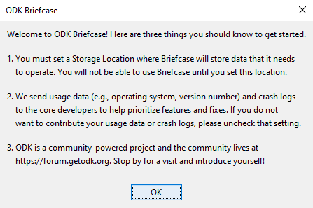
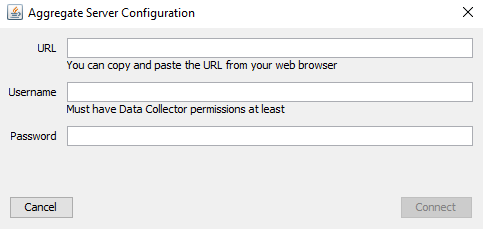
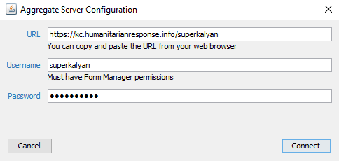
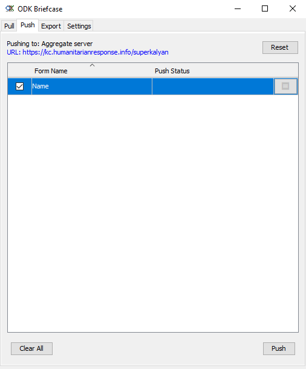
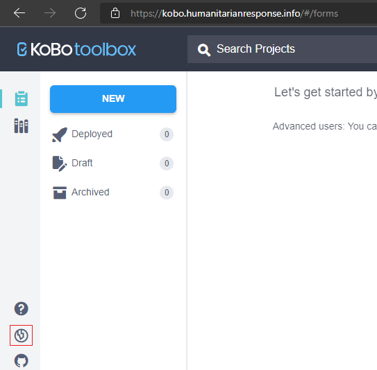

# Migrating Projects from One KoboToolbox Server to Another Using ODK Briefcase

Depending upon the nature of use, KoboToolbox publicly offers two different servers: the *humanitarian server* and the *non-humanitarian server* (if you’re just getting started, you can learn more through **[Which Server Should I Use?](server.md)**). These servers are in two different parts of the world. The *humanitarian server* is located in the Ireland while the *non-humanitarian server* in the US. The system does not have a built-in feature to migrate a project from one server to the other. However, this limitation of migrating a project between servers can be addressed  with **[ODK Briefcase](https://docs.getodk.org/briefcase-intro/)**.

This support article aims to illustrate the detailed steps of migrating a project from one KoboToolbox server to the other using *ODK Briefcase*. In addition, the article should also be helpful to new users wishing to migrate a project to KoboToolbox from other data collection platforms that are compatible with KoboToolbox (*ODK Aggregate*, *Formhub*, *ONA*, etc.).

The steps outlined below depict the migration of a project from the *non-humanitarian server (kf.kobotoolbox.org)* to the *humanitarian server (kobo.humanitarianresponse.info)*. As mentioned above, you can follow these steps to migrate a project across either KoboToolbox server or from any platform compatible with KoboToolbox.

**Step 1: Confirm the project details from your origin server**

In our example, the origin server here refers to the *non-humanitarian server* aka the *Kobo server*. Confirm the project name and total submissions for the project you wish to migrate. The project for this support article has 5 submissions.

**Step 2: Download the latest version of ODK Briefcase**

Download the latest version of *ODK Briefcase* (from **[here](https://github.com/getodk/briefcase/releases)**) to your personal computer.

**Step 3: Configure the Storage Location of ODK Briefcase**

Double click the *ODK Briefcase* that you just downloaded. You should be able to see a dialogue box as shown below:

Press **OK** to continue. You will then be directed to *ODK Briefcase* application as shown below:

Configure the **Storage Location** as per your convenience by pressing **Choose …**. You should now see something similar as shown below _(here you will notice that once you configure your **Storage Location**, ODK Briefcase application activates the **Pull**, **Push** and **Export** tabs)_:

**Step 4: Configure the Pull settings of ODK Briefcase**

Select the **Pull** tab. You should now see a similar screen as shown below:

Select **Configure**. You should see a dialogue box as shown below:

Fill up the **URL** and login credentials (**Username** and **Password**) from your *non-humanitarian server (Kobo server)* as you wish to migrate a project from this server to the *humanitarian server (OCHA server)*. You could do it as shown in the image below:

You will need to replace the username `superkalyan` with your own KoboToolbox username. Please note that you will need to use this URL format `https://kc.kobotoolbox.org/username` where the `username` should be your KoboToolbox username. *ODK Briefcase* will fail to pull the data from your server if you fail to use the URL format advised above.

**Step 5: Pulling the project to ODK Briefcase storage**

Once the **Pull** configuration settings are done, you should be able to see the following screen as shown below:

Now check the project that you wish to pull to your *ODK Briefcase* storage. Then select **Pull** located at the right end corner of the dialogue box. You should see **Success** under the **Pull Status** as shown below:

This means that your project was successfully pulled to your *ODK Briefcase* storage.

**Step 6: Configure the Push settings of ODK Briefcase**

Select the **Push** tab. You should now see a similar screen as shown below:

Select **Configure** and fill up the dialogue box with the **URL** and login credentials (**Username** and **Password**) from your *humanitarian server (OCHA server)* as you wish to migrate everything to this server now (as shown in the image below):

You will need to replace the username `superkalyan` with your own KoboToolbox username. Please note that you will need to use this URL format `https://kc.humanitarianresponse.info/username` where the `username` should be your KoboToolbox username. The *ODK Briefcase* will fail to push the data to your server if you fail to use the URL format advised above.

**Step 7: Pushing the project from ODK Briefcase storage to the destination server**

Once the **Push** configuration settings are done, you should be able to see the following screen as shown below:

Now check the project that you wish to push to your other KoboToolbox server. Then select **Push** located at the right end corner of the dialogue box.
 

You should see **Success** under the **Push Status** as shown below:

This means that your project was successfully pushed to the desired KoboToolbox server (i.e., to your destination account). Your destination server here refers to the *humanitarian server*, also known as the *OCHA server*.

**Step 8: Ensure that the project has been successfully migrated in your destination server**

Once the push is successful through the *ODK Briefcase*, ensure that the project has been migrated to your server (in this case the *humanitarian server*, also known as the *OCHA server*). You should still see that the submissions are not present in the KPI as shown below:

Go to the legacy UI by selecting the legacy icon located at the left down corner as shown below:

You should now see the migrated project along with its data in the legacy UI.

To further access the data, select the project name. You should be able to download the project data by clicking **Download data** or view the gallery by clicking **View gallery** or download the project media by clicking **Download all photos**, as shown below:

<strong>Note:</strong> You should still be able to continue data collection for this project that you have recently migrated to the destination server.

## Limitations:

* The migrated project should have the same limitations that the legacy UI should have.

* Data for the migrated projects can only be collected through the *KoboCollect Android App*. Collecting data with *Enketo* is not supported for such projects.

* The migrated projects can only be managed (*Download data*, *View gallery*, *Download all photos*) through the legacy UI. Managing the same through the KPI UI is not supported.

* You should only be able to download the project data from the migrated project. The system does not support downloading the survey form (XLSForm). 

* Syncing a migrated project from the legacy UI to the KPI UI is not supported.