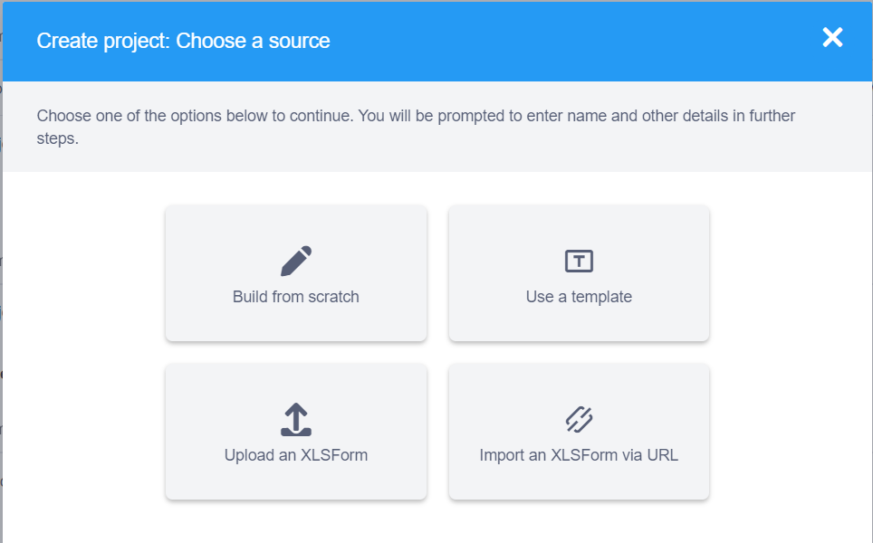
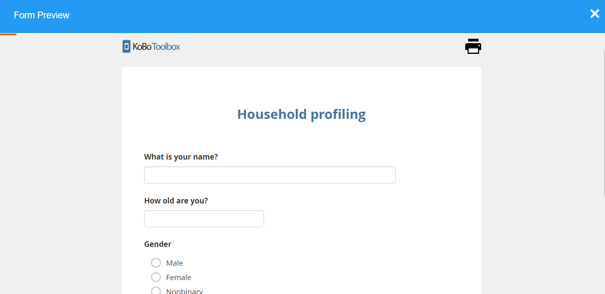

# Overview of creating a project

Once you’ve logged in to your **KoboToolbox** account, you can start creating
your data collection project right away with our simple-to-use formbuilder. This
article gives you a quick overview of how you can create a data collection
project, add questions and deploy it for data entry. Use these guidelines as
your basic introduction to developing and deploying forms in **KoboToolbox**,
after which you can go through the rest of the articles in this support site to
go deeper into the steps you will learn here.

## Creating your first form

-   After logging in to your account, click the big blue **NEW** button at the
    top. You will be presented with the “Create a project: choose a source”
    dialogue box.

| Option                    | Description                                                                                                           |
| ------------------------- | --------------------------------------------------------------------------------------------------------------------- |
| Build from scratch        | Build a form using the **KoboToolbox** <a href="formbuilder.html">formbuilder</a>                                     |
| Use a template            | Build a form using a template from the <a href="add_questions_library.html" class="reference">question library</a>.   |
| Upload XLSForm            | Upload an <a href="https://xlsform.org" class="reference">XLSForm</a> file where you have defined your questions.     |
| Import an XLSForm via URL | Upload an XLSForm file <a href="xls_url.html" class="reference">from an online source such as Google Drive or Dropbox |

-   Click **Build from scratch** to start creating your form using the
    formbuilder.
-   On the Project Details dialogue box that opens up, enter the details of your
    project and then click **CREATE PROJECT**

| Field                  | Description                                                       |
| ---------------------- | ----------------------------------------------------------------- |
| Project Name           | The title of your project                                         |
| Description (optional) | A descriptive paragraph to make it easy to identify your project  |
| Sector (optional)      | The sector in which the data collection project is being deployed |
| Country (optional)     | The country where the data collection project will be deployed    |

  You can check the last option to anonymously share the sector and country
  information with <strong>KoboToolbox</strong>. The data is used to help
  improve the <strong>KoboToolbox</strong> platform.

## Adding questions

Once the formbuilder opens up, you can start adding your questions.

-   **1.** Click the <i class="k-icon k-icon-plus"></i> button below the message
    that says “This form is empty”.
    
-   **2.** Type in your question text.
-   **3.** Press ENTER or click the **ADD QUESTION** button.
    
-   **4.** Finally, select the question type from the list (see the practice
    example below)

---

### Try if for yourself

Let’s add the following questions:

-   What is your name?
-   How old are you?
-   Gender: Male; Female; Nonbinary; Prefer not to say

**Steps:**

-   **1.** Click the <i class="k-icon k-icon-plus"></i> button to add a new
    question
-   **2.** Type: What is your name
-   **3.** Press ENTER or click **ADD QUESTION**
-   **4.** Choose the **Text** question type
-   **5.** To add the second question, click the **+** button just below the
    question you just added
    
-   **6.** Type: How old are you?
-   **7.** Press ENTER or click **ADD QUESTION**
-   **8.** Choose the **Number** question type
-   **9.** Finally, click the **+** button just below the second question you
    added
-   **10.** Type: Gender
-   **11.** Press ENTER or click **ADD QUESTION**
-   **12.** Choose the **Select one** question type
    -   On Option 1, type: Male.
    -   On Option 2, type: Female
-   **13.** Click **Click to add another response** and type Nonbinary
-   **14.** Click **Click to add another response** and type Prefer not to say
-   **15.** Click the **SAVE** button at the top right of the formbuilder

The form will look as follows:

---

## Previewing the form

It helps to preview the form to see how it is going to display on data entry.
Only the web form preview is available from the formbuilder.

Click the <i class="k-icon k-icon-view"></i> Preview icon on the grey toolbar to
go to preview mode

The form we created in the Adding Questions practice above will display as
follows:

You can press the Escape key (Esc) on the keyboard to return to the formbuilder
(or click the close button on the Form Preview window)

  <strong>KoboToolbox</strong> has functionality that allows you to define
  <a class="reference" href="skip_logic.html">Skip logic</a>,
  <a class="reference" href="validation_criteria.html">validation criteria</a>,
  <a class="reference" href="calculate_questions.html">perform calculations</a> and
  <a class="reference" href="language_dashboard.html">add translations</a>.

## Deploying the form

Once you have finished developing the form, you need to deploy it to start data
entry.

-   **1.** Make sure you have saved all the changes you have made to the form
    (If there is a **\*** on the **SAVE** button, you might have changes that
    need to be saved.)
-   **2.** Click the <i class="k-icon k-icon-close"></i> close button next to
    the **SAVE** button at the top

-   **3.** Click the **DEPLOY** button.

If you don’t have any errors, a “deployed form” message will appear at the
bottom left corner.

Please note that the screen will refresh to show you the current version of the
form and options for collecting data using the form.

## Entering data using the web form

To enter data using the web form:

-   **1.** Choose the data entry method from the drop down list below the
    heading **Collect data**. For the sake of this article, we will leave the
    default “Online-Offline multiple submission”. This option opens up Enketo
    Web Form, and allows you to enter multiple submissions to the form even
    while you are offline.

For other Web form data entry modes, [read this
article](https://support.kobotoolbox.org/data_through_webforms.html)

To learn how to configure and enter data using KoboCollect, [read this
article](https://support.kobotoolbox.org/kobocollect_on_android_latest.html)

-   **2.** Click **OPEN** A new window will open with your form.

-   **3.** Enter data on the form and click **SUBMIT** when you finish

  <strong>Practice: Adding questions</strong>
  Practice entering several dummy records using the form we developed in Adding
  Questions practice.

## Viewing the data

After entering some records using the web form:

-   **1.** Switch back to the browser tab where you were developing the form.
-   **2.** Refresh the browser window.

You will see the number of records that has been submitted on the top right of
the screen:

-   **3.** View the data submitted, click the “DATA” tab at the top.

## Downloading the data

While you are on the data tab:

-   **1.** Click on Downloads on the menu on the left.

-   **2.** Click **EXPORT** to generate an XLS (Excel) file using the default
    settings.
-   **3.** Once the file is generated and shown under the “Exports” table, click
    the download button next to it.

You can now open your downloaded file.

  Learn more about exporting and downloading your data in
  <a href="https://support.kobotoolbox.org/~download.html"
    >this support article</a
  >

