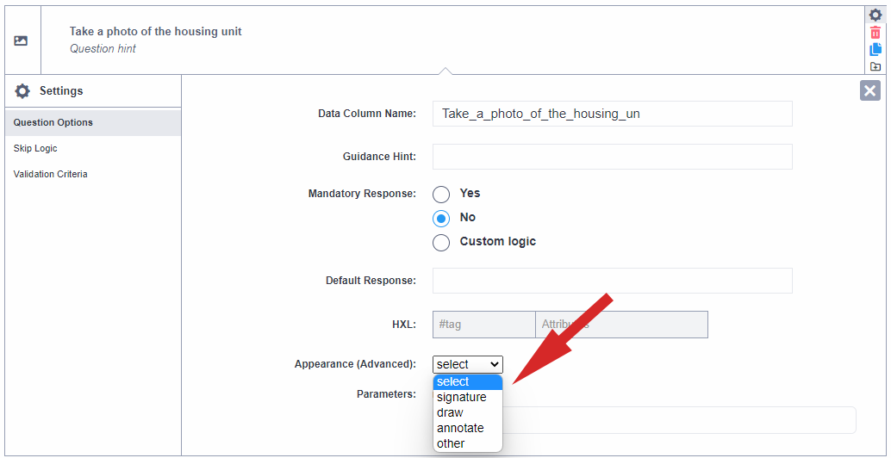
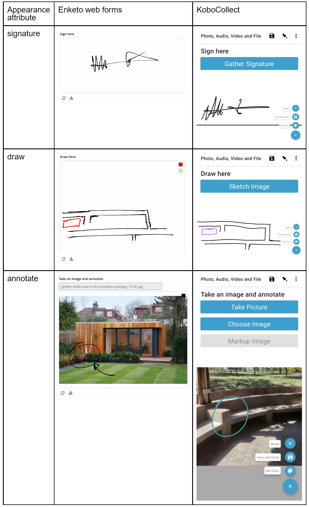

# Photo, audio, video and file question types

With KoboToolbox, you can collect different types of media as part of your data
collection project.

When you want to capture images as part of your submissions, use the “Photo”
question type.

If a question requires that you record or attach an audio file, such as when a
long explanation is expected from the respondent, use the “Audio” question type.
The latest version of KoboCollect allows you to record audio within the app
itself without opening a separate app.

With the “Video” question type, you will be able to record a video using the
device camera or attach a video file. This may be particularly useful when a
question requires the respondent to demonstrate something.

If a question requires that you attach a file such as a PDF, you can use the
“File” question type.

Note: Your device should also have an in-built camera and audio recorder to use
the "photo", "audio" and "video" question types while collecting data..

## How to set up "photo", "audio", "video" and "file" question types

### Setting up in FormBuilder

Adding media questions on the form is easy and does not require any extra setup:

-   In the KoboToolbox Formbuilder, click the + button to add a new question
-   Type the question text, for example “Take a picture of the housing unit”,
    then click ADD QUESTION or press ENTER on your keyboard
-   Choose the question type

### Setting up in XLSForm

To add media questions in xlsform, use the `photo`, `audio`, `video`, and `file`
question types as shown in the following example:

| type  | name        | label                                                       | hint            |
| :---- | :---------- | :---------------------------------------------------------- | :-------------- |
| photo | house_photo | Take a photo of the housing unit                            |                 |
| audio | impact      | What has been the impact of the project on your household?  | Record as audio |
| video | preparation | Record video of the respondent as they prepare the VitaMeal |                 |
| file  | CV          | Attach your CV                                              |                 |

## Appearance of Photo, audio, video and file question types in web forms and KoboCollect

### Default appearance

### Advanced appearances for "photo" question type

When adding the “Photo” question type, you can choose from a number of
appearances (under the question settings). Appearances change the way the
question is displayed on web forms or on KoboCollect.

### Adding advanced appearances in xlsform

You can specify advanced appearances of the "photo" question in XLSForm under
the appearance column as shown in the following example:

| type  | name       | label                      | appearance |
| :---- | :--------- | :------------------------- | :--------- |
| photo | sign       | Sign here                  | signature  |
| photo | drawing    | Draw here                  | draw       |
| photo | annotation | Take an image and annotate | annotate   |

## Background audio recording

KoboToolbox now allows you to record audio in the background when you open the
form. This can be useful in scenarios for example when you are collecting data
through focus group discussions and you need an audio of the whole interview for
analysis later.

You can turn on background audio recording in the Form Builder by clicking on
Layout & Settings.

In XLSForm, you can add the background recording feature by using the
background-audio meta question type as follows:

| type             | name             | label |
| :--------------- | :--------------- | :---- |
| background-audio | background_audio |       |

<section class="note">

Note: It is not possible to record audio using “Audio” question type while
background audio recording is underway on the form. When background audio
recording is on, all “Audio” question types are deactivated.

</section>

Read more about background audio recording
[on the linked article](recording-interviews.md).

## Lowering the file size of collected media

If your form will be collecting a lot of media, you might find it difficult to
upload them to the KoboToolbox Server or download the media attachments from it.
This is why it is always a good idea to manage the file sizes of collected media
files such as images and videos.

You can define the maximum size of images you collect using the “Photo” question
type by going to the question settings and setting the “max-pixels” setting in
the formbuilder.

In XLSForm, you can do the same by adding max-pixels in the parameters column as
follows:

| type  | name  | label         | parameters     |
| :---- | :---- | :------------ | :------------- |
| photo | photo | Capture photo | max-pixels=480 |

In KoboCollect, you can also choose the video quality and photo size through the
Form Management section of the project settings.

Read more about how to lower file sizes in
[this linked article](lower_file_size.md).

## Limiting uploadable file types for “File” question type

When you add a “File” question type, any type of file can be uploaded by the
person entering the data. In order to control the kind of files that can be
uploaded, follow the following steps in the Formbuilder:

-   Go to the settings of the “File” question
-   Under the “Accepted Files” box, enter the file extensions of the files you
    would like to allow, separated by a comma e.g. .doc, .pdf, .xlsx

In XLSForm, you can limit the uploadable file types as follows:

| type | name | label          | body::accept |
| :--- | :--- | :------------- | :----------- |
| file | CV   | Attach your CV | .pdf, .doc   |
