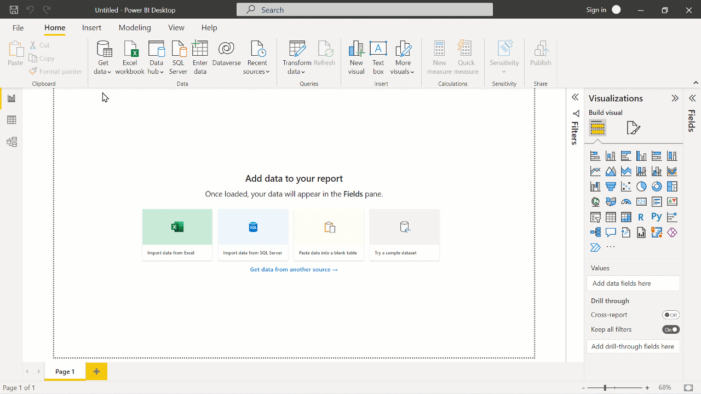

# Connecting KoboToolbox PowerBI

The KoboToolbox API allows you to connect your project with other data analysis
tools such as PowerBI, Excel and Google Sheets. Data you collect is shared with
the external application which can then be used for analysis and visualizations
and dashboards.

One of the most popular data analysis and visualization programs you can connect
to is Microsoft PowerBI.

This article walks you through the steps of connecting your project with
PowerBI. If you would like to connect to Excel, refer to the article
[here](pulling_data_into_excelquery.md).

## Step 1: Get the synchronous exports URL

The first step in bringing data into PowerBI is to get the Synchronous Exports
URL through the KoboToolbox API. A detailed process for doing this is outlined
[in the article here](synchronous_exports.md).

## Step 2: Add the data source

Once you have the URL from the KoboToolbox API, you can proceed with the steps
below in PowerBI:

- Click the drop-down arrow on the “Get Data” button
- Choose “Web”
- Paste the synchronous export URL you copied and click **OK**
- Click **Basic** for adding your authentication details
- Type your KoboToolbox username and password and click **CONNECT**

If you made your project’s data public, you can connect without the need for authentication by choosing “Anonymous” in the “Access Web content” dialog box. Learn more about project permissions [here](https://support.kobotoolbox.org/managing_permissions.html).

A list of the data contained in your project will be displayed in the Navigator.

- Choose the data you would like to import.
- Click **Load** to bring the data in or click **Transform Data** to open the
  Power Query Editor, which you can use to clean up and transform the data
  before loading it.

The tables will be shown in the **Fields** panel where you can develop your
dashboards and reports.

<section class="note">

In PowerBI, you can connect multiple projects. Repeat the process above for each
project, using their synchronous export URL.

In the case where you have multiple tables (for example if you had repeat
groups), you might also need to set up table relationships. This is done in the
**Model View.** Learn more about
<a href=”https://docs.microsoft.com/en-us/power-bi/transform-model/desktop-create-and-manage-relationships”>how
to create table relationships here</a>

</section>

## Updating the data in your reports

When your project's data is updated on the KoboToolbox server, such as when you
have new submissions, changed validation statuses, edits, or deletions, you will
need to synchronize it with your reports.

To do this, click **Refresh** in the “Home” tab.

## Troubleshooting

### Failing to connect to KoboToolbox

Sometimes, even after entering the correct credentials to connect to your
project, you might get an error. This may happen if PowerBI was configured to
connect to one account before, and you are now trying to connect using a
different account from the same KoboToolbox server.

To reset authentication settings:

- Go to **File -> Options and Settings -> Data Source Settings**. Select the
  existing permissions in the dialog box and click **Clear Permissions**. Close
  and try adding the new connection again.

### Failing to refresh data

If you are getting an error when refreshing data, there could be a number of
reasons:

- Your authentication details might have changed. You will need to follow the
  instructions above to change your **Data Source Settings**.
- One or more fields in your form might have been deleted or renamed.
  [You will need to edit the query](https://docs.microsoft.com/en-us/power-bi/transform-model/desktop-query-overview).
- There might be a data-type mismatch, especially if you changed the data-type
  of one or more fields in PowerBI. You can attempt to reset the data-type
  before refreshing the connection.
