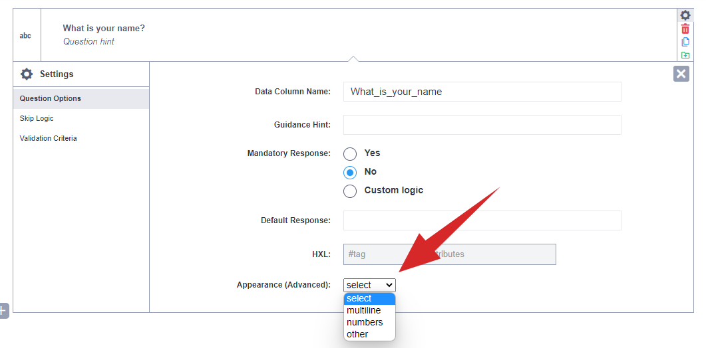

# Text and Note question types

The “Text” question type is used for those questions that require individual
responses that can not be pre-defined as a list. Open-ended questions, such as
those requiring long answers or information only each individual respondent can
provide, are best collected with open-ended text responses.

“Notes” may not necessarily be questions at all, as they do not provide any way
for the respondent to enter information. Notes do not require any response.
Instead, they offer the form designer the opportunity to add instructions,
additional information or an introduction to the following set of questions to
make the survey clearer or easier to navigate. For instance, you can use a
'Note' question type to inform the respondent or enumerator about what the next
section of questions contains, providing background context for why the survey
is being done, or displaying the results of hidden calculations
[Including Responses Inside Another Question](responses_inside_question.md).

## How to set up “Text and “Note” questions

Setting up text or note questions is very similar:

-   In the KoboToolbox Formbuilder, click the + button to add a new question.
-   Type the question text. For example, What is your name?. Then click Add
    Question (or press Enter).
-   Choose the question type (“Text” or “Note”)

## Appearance of “Text and “Note” questions in web forms and KoboCollect

### Default appearance

<section class"note">
The default text box in Enketo Webform accepts only one line of text. However, in KoboCollect, the text field expands as you type. You can also add line breaks to form paragraphs
</section>

### Advanced appearances for “Text” questions

You can change the appearance of “Text” questions under the Question options
page of the Question settings.

## Considerations when using “Text” questions

For the sake of data quality, it is advisable to use
[“Select one” or “Select many” question types](selectone_selectmany.md) when you
can easily predefine a list of the text responses. Limiting responses to a list
facilitates later data processing and analysis.

Additionally, it ensures that you avoid spelling mistakes resulting in multiple
versions of the same response. As a result, your data cleaning and analysis
becomes much more manageable.

List of responses in “Select one” and “Select many” questions can also include
an option for “other,” which you can set up to require a user to fill in the
other response in a separate “Text” question to capture responses that are not
on the list as outlined in the support article
[User-Specified “Other” Responses for Multiple-Choice Questions](user_specified_other.md).

The use of the “Text” question type must be limited to genuinely open-ended
questions where you can not easily per-define a list of responses.

## “Text” questions in “skip”, “validation”, and “required” logic

When you define a question as “Text” type, it is open-ended. This means
respondents or enumerators can type in any answer. Although this makes “skip”,
“validations” and “required” logic a bit challenging, it is still possible to
implement them using what is known as “Regular Expressions” or RegEx in short.

With RegEx, you can implement validation logic, such as limiting the length of
text responses or only allowing responses that are in capital letters. It is
then also possible to make a question required when a preceding text question
contains a particular word or when it is of a certain length.

To learn more about implementing RegEx,
[read the support article “Restricting Text Responses With Regular Expressions”](restrict_responses.md)
